# Bitcoin Market State Prediction Using On-Chain Data and Robust Temporal Evaluation

**Course:** SC6122 Emerging Topics in FinTech  
**Institution:** Nanyang Technological University  
**Team:** Chen Zhiyu, Liu Ruyan, Shi Xiangyan, Yang Shuyi  

## Abstract

This project studies whether Bitcoin market regimes can be predicted from daily on-chain indicators under a realistic, leakage-safe temporal protocol. We formulate a 3-class task with a 30-day horizon: **Bull** (> +15%), **Bear** (< -15%), and **Sideways** (otherwise). Using merged blockchain and on-chain valuation data from 2010-2023, we build 176 engineered features and evaluate classical ML, deep learning, reinforcement learning, and ensembles under a strict chronological 80/20 split.

Our best result is achieved by a stacking ensemble with confidence-based routing, reaching **macro-F1 = 0.4124** (Accuracy = 0.4283, ROC-AUC = 0.5796). This outperforms all individual models on macro-F1 and improves minority-regime detection compared with single-model baselines. We further run controlled binary benchmarks and an external CNN-LSTM replication inspired by Omole & Enke (2024). Under our strict temporal protocol and dataset pipeline, these binary replications do **not** reproduce the paper-level high accuracy (82.44%), indicating that task design, data source, and distribution shift strongly affect reported performance.

The project highlights a key practical finding: in cryptocurrency forecasting, robust evaluation design (strict chronology, no leakage, and class-sensitive metrics) is as important as model complexity.

---

## 1. Introduction

Bitcoin price behavior is highly nonlinear, regime-dependent, and sensitive to macro shocks. While many studies report strong predictive performance, results are often inflated by random splits or weak temporal controls. For real deployment, a model must generalize from older periods to structurally different future periods.

We therefore focus on a stricter question:

> Can on-chain features predict **30-day forward market state** under a strict chronological split, with macro-F1 as the primary metric?

This setting is harder than binary next-day direction prediction, but better aligned with medium-horizon portfolio decisions and risk management.

### Contributions

This report contributes a leakage-safe end-to-end pipeline for 3-class Bitcoin market-state prediction, a comprehensive comparison across 10 model families (linear, tree-based, sequence, RL, and ensembles), a confidence-routed stacking strategy that achieves the best macro-F1, and controlled external benchmarks (binary CNN-LSTM inspired by prior paper) to contextualize performance claims.

---

## 2. Problem Statement and Evaluation Protocol

### 2.1 Label Definition (Main Task)

Let
\[
r_{t,30} = \frac{P_{t+30} - P_t}{P_t}
\]

Market-state labels are defined as Bull when \(r_{t,30} > 0.15\), Bear when \(r_{t,30} < -0.15\), and Sideways otherwise.

### 2.2 Why Macro-F1

Accuracy is misleading when one class dominates. We optimize and report **macro-F1** to equally weight Bull/Bear/Sideways performance, with Accuracy and ROC-AUC as secondary metrics.

### 2.3 Anti-Leakage Design

We enforce strict chronological 80/20 splitting without shuffling, fit feature selection and scaling on training data only, tune models with TimeSeriesSplit-based cross-validation, and exclude target or future-return columns from model features.

---

## 3. Dataset and Feature Engineering

### 3.1 Data Sources

Merged daily data comes from two real on-chain datasets, `blockchain_dot_com_daily_data.csv` and `look_into_bitcoin_daily_data.csv`.

Date range after cleaning: roughly 2010-08 to 2023-09.

### 3.2 Processing

Processing uses an inner join on `datetime`, unified price-field construction, numeric cleaning, forward/backward filling for remaining numeric missing values, and removal of unusable non-numeric fields where necessary.

Figure 1 shows the core label distribution and price context used in the main experiment.

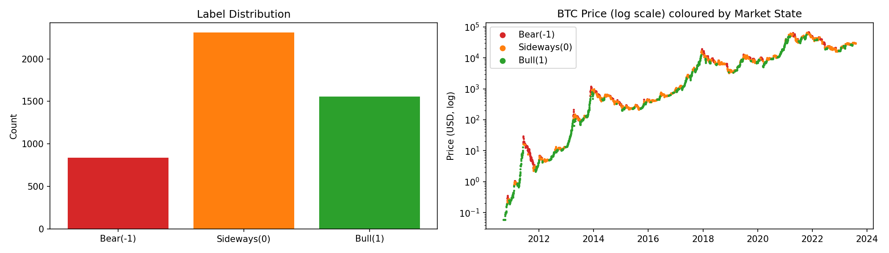

### 3.3 Feature Engineering

From base on-chain metrics, we generate rolling means (7/14/30), lag features (1/3/7/14/30), momentum and volatility features, and MVRV-related valuation features.

Total engineered features: **176**, then reduced to top **40** for the main 3-class experiments via train-only RF importance.

---

## 4. Methods

### 4.1 Individual Models

Individual models include Logistic Regression, Random Forest, XGBoost, LightGBM, SVM, KNN, an LSTM sequence model, and a DQN exploratory RL baseline.

### 4.2 Ensemble Methods

Ensemble methods include a Soft Voting ensemble and a Stacking ensemble (RF + KNN + LGB + XGB) with confidence-based routing and LightGBM emphasis in the final decision stage.

Hyperparameters are tuned with `GridSearchCV + TimeSeriesSplit`.

---

## 5. Main Results (3-Class, 30-Day Horizon)

### 5.1 Performance Summary

| Model | Accuracy | Macro-F1 | ROC-AUC |
|---|---:|---:|---:|
| Logistic Regression | 0.1977 | 0.1843 | 0.5611 |
| Random Forest | 0.5781 | 0.3105 | 0.5217 |
| XGBoost | 0.2529 | 0.1644 | 0.6103 |
| LightGBM | 0.3369 | 0.3384 | 0.6158 |
| SVM | 0.2179 | 0.1223 | 0.3870 |
| KNN | 0.5770 | 0.3119 | 0.4974 |
| Voting Ensemble | 0.4198 | 0.3903 | 0.5926 |
| LSTM | 0.5675 | 0.3452 | 0.5831 |
| DQN (RL) | 0.3411 | 0.3384 | N/A |
| **Stacking (RF+KNN+LGB+XGB)** | **0.4283** | **0.4124** | **0.5796** |

### 5.2 Key Findings

The best model for the main objective is stacking, with macro-F1 **0.4124**. We also observe that high accuracy does not imply balanced regime detection, as RF and KNN achieve high accuracy but materially lower macro-F1 than stacking. Finally, distribution shift in late-cycle periods, especially 2022-2023, reduces generalization across all model families.

Figure 2 and Figure 3 summarize overall model performance and class-level behavior.

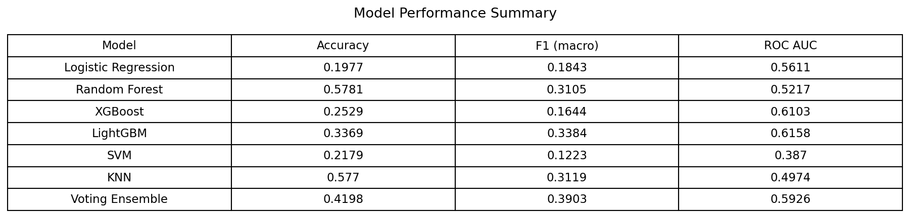

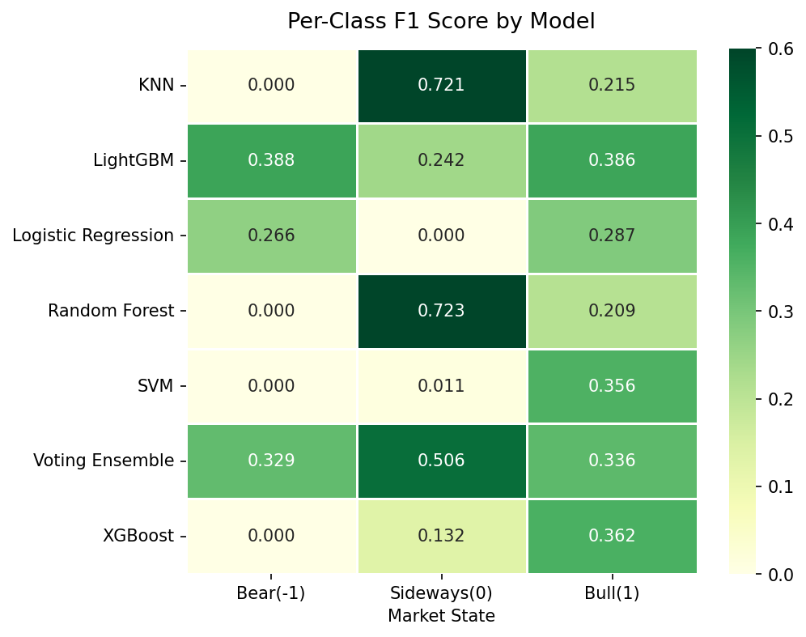

Figure 4 and Figure 5 provide a diagnostic view of temporal shift and discrimination quality across models.

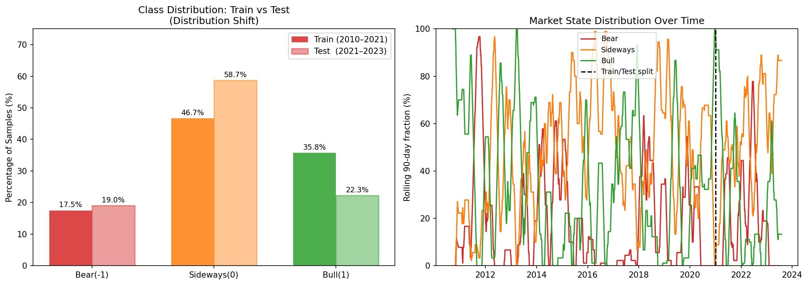

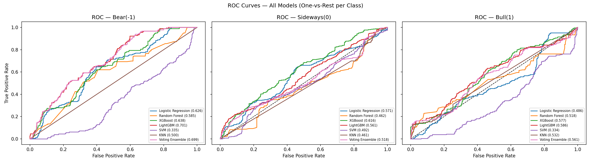

For interpretability, Figure 6 and Figure 7 show combined and model-specific feature importance.

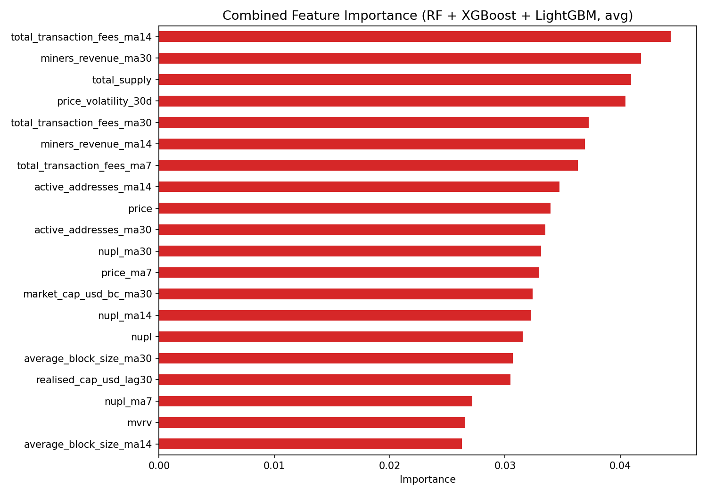

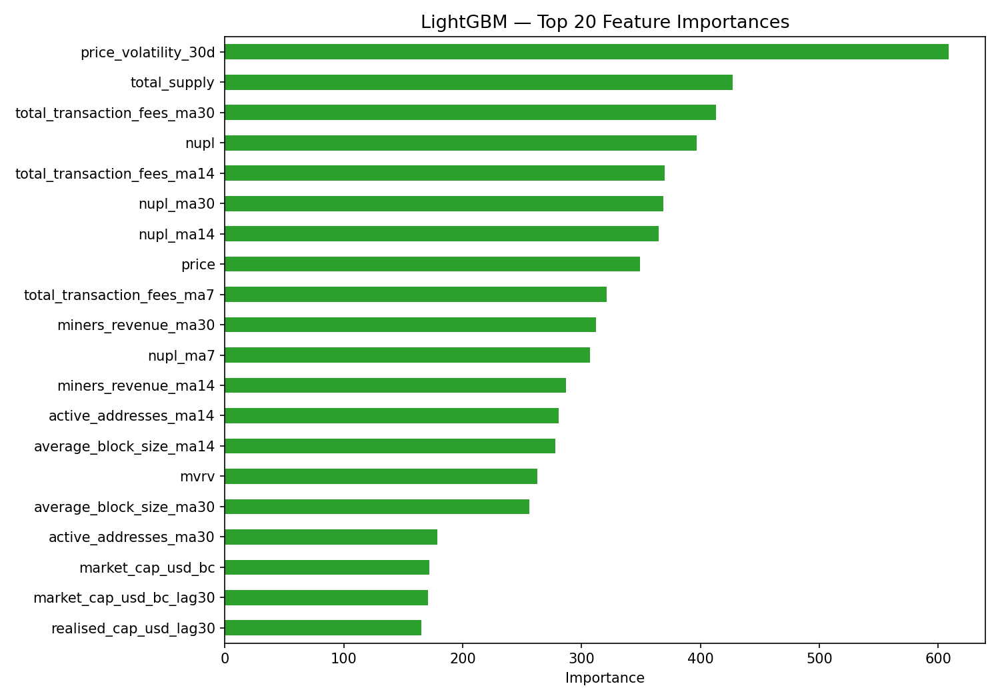

---

## 6. Controlled Binary Benchmarks

To interpret task difficulty, we ran additional binary tasks without modifying the main 3-class setup.

### 6.1 Internal Binary Baseline (`run_binary.py`, ±5% neutral removed)

The best model in this binary baseline is **XGBoost**, with Accuracy 0.5720 and Macro-F1 0.5720.

This is higher than 3-class macro-F1, consistent with binary direction being easier than 3-class market-state classification.

Figure 8 shows the binary baseline comparison across models.

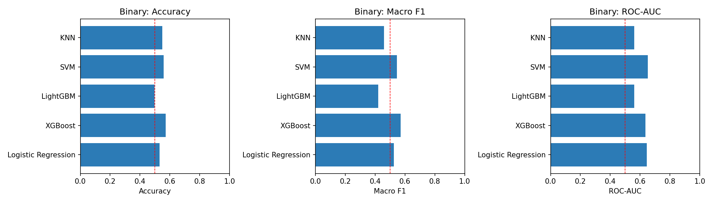

### 6.2 External Benchmark Replication (CNN-LSTM + Boruta-like)

Two label modes were tested under strict chronology and leakage controls. In `zero`, Up is defined as 30-day return > 0. In `threshold5`, Up is return > +5%, Down is return < -5%, and neutral samples are dropped.

Selected results:

| Setting | Model | Accuracy | Macro-F1 | ROC-AUC |
|---|---|---:|---:|---:|
| zero | CNN-LSTM | 0.4775 | 0.4268 | 0.5371 |
| threshold5 | CNN-LSTM | 0.4208 | 0.3949 | 0.4653 |
| threshold5 | XGBoost | 0.5667 | 0.5640 | 0.5963 |

### 6.3 Paper-Protocol-Inspired Variant (Next-Day Direction)

We added a closer protocol variant inspired by Omole & Enke (2024), using next-day binary labels (`price(t+1) > price(t)`), a window grid of {3, 5, 7, 14, 30}, BorutaPy-based selection, and temporal 80/20 splitting.

Observed outcomes show an honest (validation-selected window) test accuracy of about 0.5076 and a grid max (paper-style best over tested windows/seeds) of about 0.5158.

Compared with paper-reported 82.44%, this remains much lower.

Figure 9 and Figure 10 present the confusion matrix and training dynamics for the strict external benchmark, while Figure 11 summarizes the paper-protocol window-grid behavior.

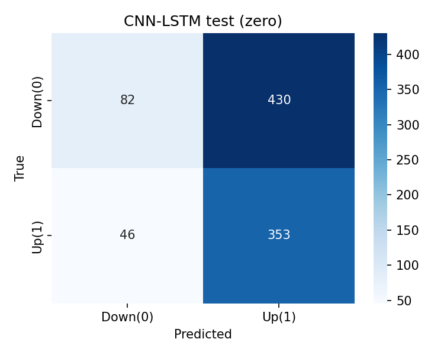

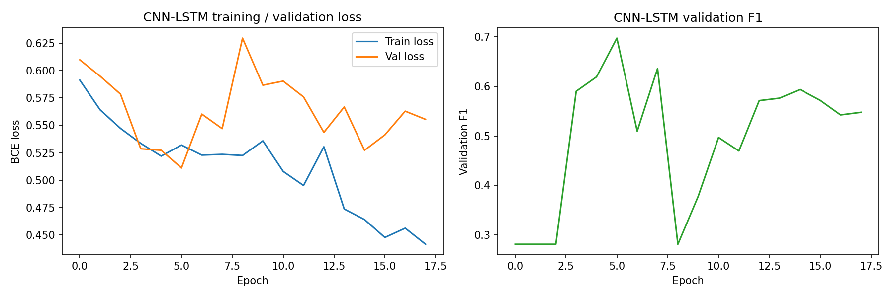

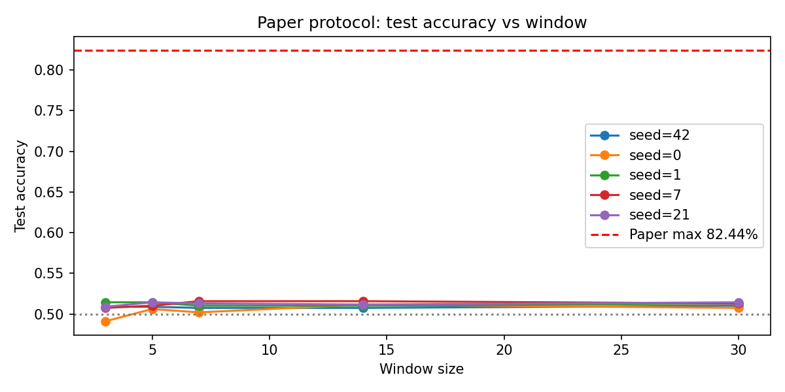

---

## 7. Discussion

### 7.1 Why Results Differ from High Reported Paper Accuracy

Even under a more paper-like binary setup, we do not approach 82.44%. The likely reasons are data-source mismatch between our merged dataset and the paper’s original data stack, task and label differences because the main pipeline remains a harder 3-class 30-day horizon problem, strong distribution shift in strict temporal holdout periods, and reporting-protocol differences where “overall max” across seeds/windows is typically more optimistic than fixed pre-registered evaluation.

### 7.2 Practical Interpretation

The main 3-class task is challenging but still meaningful for risk-aware market-state analysis. A macro-F1 around 0.41 under strict chronology should be interpreted as credible rather than inflated. Controlled binary gains confirm that predictive signal exists, but not at a level that supports overly optimistic claims under robust evaluation.

---

## 8. Conclusion and Future Work

This project delivers a reproducible, leakage-safe framework for Bitcoin market-state prediction and shows that confidence-routed stacking is the most effective strategy for balanced 3-class performance. It also shows that strict temporal evaluation materially lowers apparent performance versus less rigorous setups, and that external binary replication under our controls does not reproduce paper-level high accuracy, reinforcing the importance of protocol comparability.

### Future Work

Future work will focus on walk-forward retraining with rolling recalibration, better regime-shift handling through domain adaptation or drift-aware training, enriched exogenous features such as macro and sentiment signals, and calibration-aware threshold optimization for class-sensitive deployment.

---

## 9. Workload Distribution

Following the project guideline, contribution breakdown is as follows: **Chen Zhiyu** led data integration, cleaning, the feature pipeline, and EDA; **Liu Ruyan** led the LSTM and external benchmark modules and report integration; **Shi Xiangyan** led baseline model training and the evaluation pipeline; **Yang Shuyi** led boosting models, ensemble analysis, and visualization/report polishing.

All members contributed to experiment review, interpretation, and final report revision.

---

## References

1. Chen, T., & Guestrin, C. (2016). XGBoost: A Scalable Tree Boosting System.
2. Ke, G. et al. (2017). LightGBM: A Highly Efficient Gradient Boosting Decision Tree.
3. Hochreiter, S., & Schmidhuber, J. (1997). Long Short-Term Memory.
4. Mnih, V. et al. (2015). Human-level control through deep reinforcement learning.
5. Omole, O., & Enke, D. (2024). Deep learning for Bitcoin price direction prediction.

